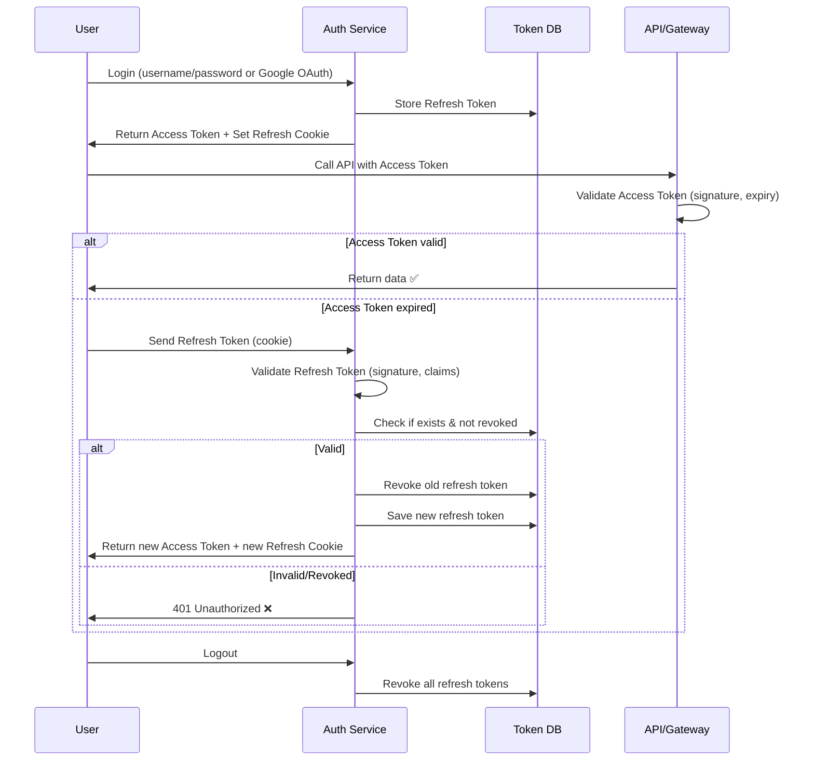
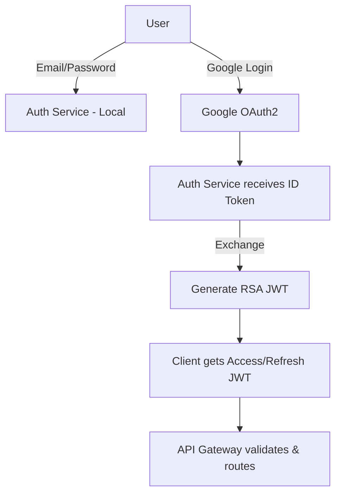

# 🆘 Medicare Microservices Platform

This document is the **developer guide** for the **Medicare Microservices Application**.  
It covers architecture, authentication (JWT + Google OAuth2), RSA key usage, and service flows.

---

## 📦 Microservices Architecture

The system is built with **Spring Boot Microservices**, integrated with **AWS** for infrastructure and **Redis** for caching.

### Core Components
- **API Gateway** – Routes requests, validates tokens (JWT + Google OAuth2).  
- **Service Registry (Eureka)** – Enables dynamic service discovery.  
- **Auth Service** – Issues JWTs, integrates Google OAuth2, manages refresh tokens.  
- **User Service** – Manages user profiles.  
- **Product Service** – Handles medicine/product catalog.  
- **Order Service** – Manages order placement and lifecycle.  
- **Inventory Service** – Tracks stock availability.  
- **Notification Service** – Sends SMS, emails, and push notifications.  
- **Payment Service** – Processes payments.  
- **Redis** – Caches tokens, manages revocations.  
- **AWS Services** – Hosts secrets, deploys infrastructure, supports scaling.  

---

## 🔑 RSA Keys & JWT

The **Auth Service** uses **RSA asymmetric cryptography** (`RS256`) for signing JWTs.  
Only the private key signs tokens, while all other services use the public key for validation.

### Key Handling
- **Private Key** → Stored in environment variables or AWS Secrets Manager.  
- **Public Key** → Exposed through a JWKS endpoint for verification.  
- **kid** → Key ID. Used in JWT headers to identify which key signed the token.  
- **JWKS** → JSON Web Key Set. Public keys in JSON format, consumed by other services.  
- **issuer** → Identifies the Auth Service (`http://localhost:9000` in dev).  
- **audience** → Identifies the target application (`medicare-api`).  

---

## ⚙️ RSA Configuration Code

### `KeyConfig.java`
```java
@Configuration
@RequiredArgsConstructor
public class KeyConfig {

    private final RsaKeyProperties rsaProps;

    @Value("${app.jwks.key-id:auth-key-2025}")
    private String keyId;

    @Bean
    public RSAPublicKey rsaPublicKey() throws Exception {
        return loadPublicKey(rsaProps.publicKeyB64());
    }

    @Bean
    public RSAPrivateKey rsaPrivateKey() throws Exception {
        return loadPrivateKey(rsaProps.privateKeyB64());
    }

    @Bean
    public RSAKey rsaJwk(RSAPublicKey publicKey, RSAPrivateKey privateKey) {
        return new RSAKey.Builder(publicKey)
                .privateKey(privateKey)
                .keyID(keyId) // kid (key identifier) for rotation
                .build();
    }

    @Bean
    public JWKSet jwkSet(RSAKey rsaJwk) {
        return new JWKSet(rsaJwk.toPublicJWK()); // only expose public key
    }

    @Bean
    public JWKSource<SecurityContext> jwkSource(RSAKey rsaJwk) {
        return new ImmutableJWKSet<>(new JWKSet(rsaJwk));
    }

    @Bean
    public JwtEncoder jwtEncoder(JWKSource<SecurityContext> jwkSource) {
        return new NimbusJwtEncoder(jwkSource);
    }

    @Bean
    public JwtDecoder jwtDecoder(RSAPublicKey publicKey) {
        return NimbusJwtDecoder.withPublicKey(publicKey).build();
    }

    // helper methods for decoding Base64/PEM keys
    ...
}
````

### `RsaKeyProperties.java`

```java
@ConfigurationProperties(prefix = "app.jwks.rsa")
public record RsaKeyProperties(
        String publicKeyB64,
        String privateKeyB64
) {}
```

---

## 📡 Auth Service Endpoints

### Authentication

```http
POST /auth/signUp              # Register user + issue JWTs
POST /auth/signIn              # Login user + issue JWTs
POST /auth/validate?token=xyz  # Validate token
POST /auth/revokeUserToken     # Revoke user tokens
```

### Google OAuth2

```http
GET  /auth/google-login        # Redirect to Google login
GET  /login/oauth2/code/google # Callback from Google
```

### JWKS & Discovery

```http
GET /.well-known/jwks.json              # Public keys
GET /.well-known/openid-configuration   # Discovery metadata
```

### Utilities

```http
GET /auth/test               # Simple health/test endpoint
```

---


# 🔐 Authentication Flow (JWT + Refresh Token)

This project uses **JWT authentication** with **refresh token rotation** for secure session management.

---

## 1. User Login
- User logs in with **username/password** or via **Google OAuth**.
- The **Auth Service** generates:
    - **Access Token (JWT)** → short-lived
    - **Refresh Token (JWT)** → long-lived, stored in DB, sent back in **Secure Cookie**

---

## 2. Accessing APIs
- User calls the **API Gateway / Resource Server** with the **Access Token**.
- Gateway validates the token (signature + expiry).

- ✅ If valid: request is allowed
- ❌ If expired: request is denied

---

## 3. Token Refresh
- When the access token expires, the client calls the **Refresh API**.
- The **refresh token (from cookie)** is sent.
- Auth Service checks:
    - Token signature
    - Existence in DB
    - Not revoked or expired

- ✅ If valid:
    - Old refresh token is revoked
    - New access + refresh tokens are issued
    - Refresh token is returned again in a **Secure Cookie**

- ❌ If invalid/revoked:
    - User receives **401 Unauthorized**

---

## 4. Logout
- When user logs out, all refresh tokens for that user are revoked in the DB.

---

## 🔎 Visual Flow


---

## 🔎 Hybrid Login Flow (Local + Google OAuth2)



---

## 📘 Keyword Reference

* **JWT (JSON Web Token)** → Compact, signed token for authentication.
* **RS256** → RSA Signature with SHA-256.
* **kid (Key ID)** → Identifier for the RSA key used to sign the JWT. Allows key rotation.
* **JWKS (JSON Web Key Set)** → JSON format exposing public keys. Clients use this to verify JWTs.
* **issuer (`iss`)** → Entity that issues the JWT (Auth Service).
* **audience (`aud`)** → Target service/system for which the JWT is intended.
* **Access Token** → Short-lived, used to access APIs.
* **Refresh Token** → Longer-lived, used to request new access tokens.
* **Redis** → Stores active refresh tokens and revoked token lists.

---

## 🚀 Deployment Notes

* Run **Service Registry** before other services.
* API Gateway must fetch **JWKS** for token validation.
* Store **RSA keys** in **AWS Secrets Manager** in production.
* Use **HTTPS** in production (`issuer` must be HTTPS).
* Enable **Redis clustering** for scalability.
* Enable **auto-scaling** for core services (Product, Order, Inventory).

